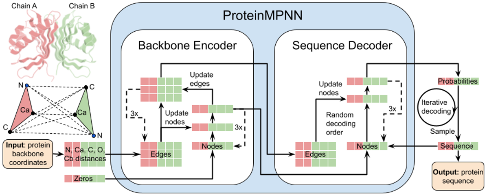
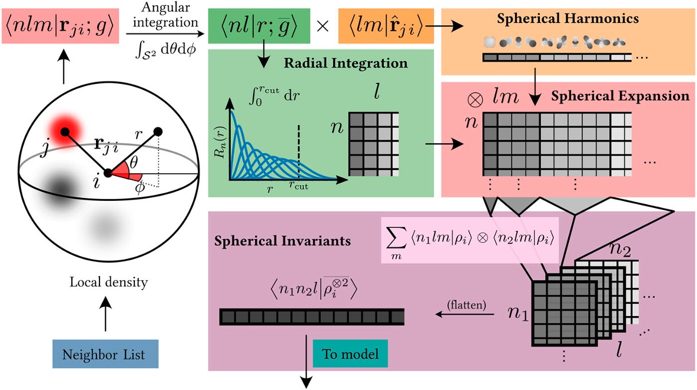

# SO3_Invariant_ProteinMPNN
## 📌 Master Thesis on Geometric Deep Learning on Protein Design
This is the code for the master thesis on introducing rotation invariant representation to ProteinMPNN, supervised by <a href="https://www.imperial.ac.uk/people/s.angioletti-uberti">Professor Stefano Angioletti-Uberti</a>
<!-- ABOUT THE RESEARCH -->
<h2 id="about-the-research"> :pencil: About The Research</h2>

**ProteinMPNN** is a message passing neural network that aims to find an amino acid sequence that will fold into a given structure. The full network is composed of an encoder and a decoder with 3 layers each. The network takes as inputs the 3D coordinates and computes the following information for each residue: (i) the distance between the N, Cα, C, O and a virtual Cβ atom, (ii) the Cα − Cα − Cα frame orientation and rotation, (iii) the backbone dihedral angles, (iv) the distances to the 48 closest residues. 
 

Building rotation invariant representation using [**Sperical Harmonics**](https://stevejtrettel.site/code/2022/spherical-harmonics), 3D coordinates of residue are expanded into radial and spherical basis, the combination of coefficients constitute an invariant representation.

Sperical Harmonics Visualisation [Website](https://stevejtrettel.site/code/2022/spherical-harmonics)

## Dataset
Protein Data Bank

## Prerequisites

  

<!--This project is written in Python programming language.  -->
The following are the major open source packages utilised in this project:
* Numpy
* SciPy
* Matplotlib
* Scikit-Learn
* Pytorch

<h2 id="folder-structure"> Folder Structure</h2>

   
      .  
      ├── images                                                       
      │    ├── ProteinMPNN.png                 
      │    └── Spherical_Expand.jpg
      │    
      │
      └── notebooks

## 🎯 RoadMap

## Future Work
Benchmarking more physics-inspired representation methods

## Acknowledgements
My appreciation goes to Professor Stefano Angioletti-Uberti and PhD researcher Shanil from <a href="https://www.softnanolab.org/">SoftNanoLab</a> for their attentive guidance and great access to computing resources.

## Contributing
If you have any questions or suggestions towards this repository, feel free to contact me at xy2119@ic.ac.uk.

Any kind of enhancement or contribution is welcomed!
